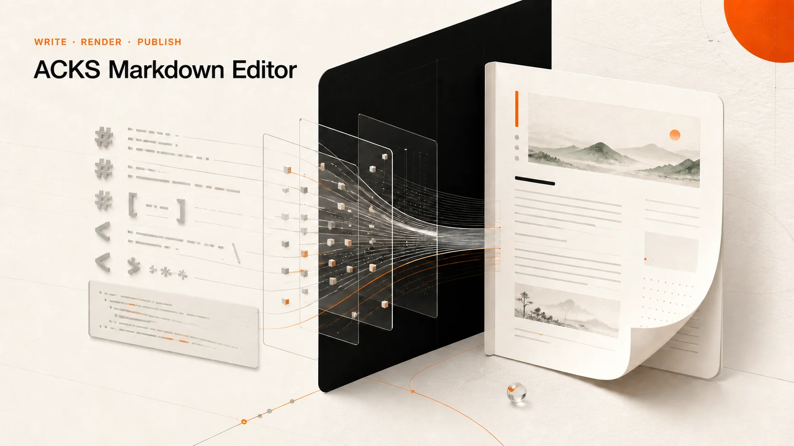
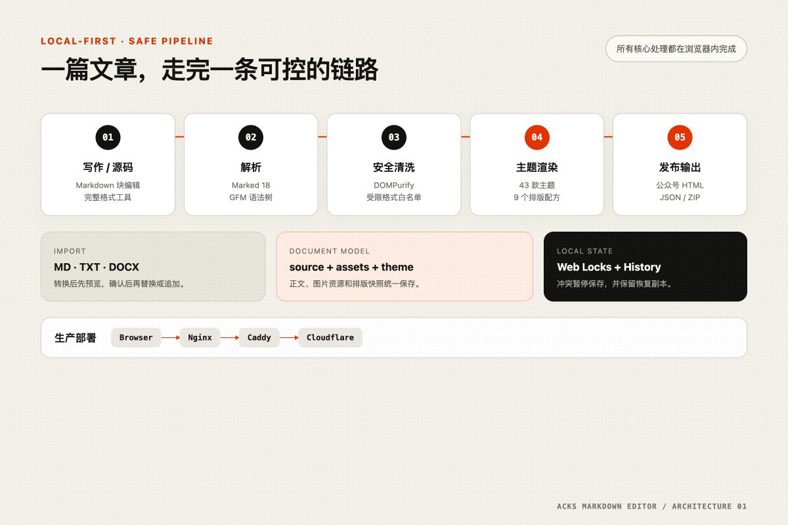
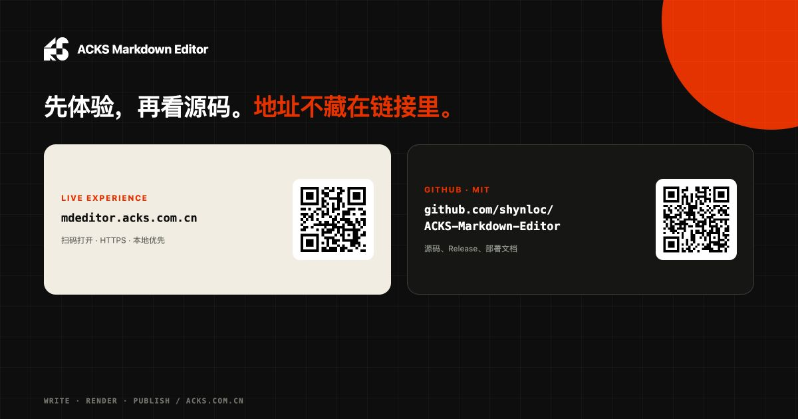

<div align="center">

# ACKS Markdown Editor

**A local-first Markdown writing and WeChat article publishing workspace**

**English** · [简体中文](README.md)

[](https://github.com/shynloc/ACKS-Markdown-Editor/releases)
[](https://mdeditor.acks.com.cn/)
[](LICENSE)
[](Dockerfile)
[](#data-storage-and-privacy)
[](#development-and-testing)

[](#technology-stack)
[](#technology-stack)
[](#technology-stack)
[](#technology-stack)
[](#technology-stack)
[](#data-storage-and-privacy)
[](#development-and-testing)
[](#production-deployment)
[](#production-deployment)

</div>



## Overview

ACKS Markdown Editor is a **local-first, single-file Markdown editor and WeChat article publishing workspace**. It combines focused writing, full-source editing, theme rendering, document import, a local article cabinet, and WeChat-ready HTML output in one interface.

Live application: **<https://mdeditor.acks.com.cn/>**

Project tags: `markdown` `wechat` `editor` `local-first` `docx` `html` `themes` `indexeddb` `docker` `caddy` `single-file-app`

## Why this project exists

The WeChat Official Account editor is a conventional rich-text editor. It is not designed around Markdown or reusable HTML workflows. Writers who work in Markdown often encounter the same problems:

- headings, lists, quotes, and code blocks change after pasting;
- images, tables, spacing, and emphasis must be repaired manually;
- one article is difficult to reuse across Markdown, WeChat, and other platforms;
- publishing becomes a second formatting job after the writing is already finished;
- traditional rich-text tools do not preserve a clean, version-friendly Markdown source.

ACKS Markdown Editor was created to keep **Markdown as the canonical source**, render and review the article locally, and produce HTML that can continue through the WeChat publishing workflow.

The project began as a single-page prototype. Repeated UX, theme, import, media-resource, storage-conflict, security, and production-deployment audits turned it into the current workspace.

## Highlights

| Capability            | Description                                                                                           |
| --------------------- | ----------------------------------------------------------------------------------------------------- |
| Three work modes      | Focused writing, full Markdown source, rendered article and WeChat output                             |
| Local article cabinet | New, Save, autosave, multi-article switching, per-article backup and protected deletion               |
| 43 rendering themes   | 19 ACKS themes plus 24 light/dark Milestone editions                                                  |
| 32 visual families    | Distinct theme ornaments and visual identities instead of repeated assets                             |
| 9 layout recipes      | Tutorial, opinion, data, list, essay, technical, news, and product-oriented layouts                   |
| Complete format tools | Headings, lists, tasks, quotes, code, tables, links, images, and extended text styles                 |
| Multi-format import   | Markdown, TXT, DOCX, ACKS JSON, and Markdown/image ZIP packages                                       |
| Local DOCX conversion | Preserves common semantic formatting and images with review before applying                           |
| Portable image model  | Short `asset:img-*` references keep Base64 data out of the Markdown source                            |
| Multiple exports      | Markdown/image package, complete ACKS document, and WeChat HTML                                       |
| Conflict protection   | Web Locks, revision comparison, recovery copies, and per-article version history                      |
| Responsive UI         | Desktop cabinet, mobile drawer, keyboard semantics, and no horizontal overflow                        |
| Single-file release   | Dependencies, icons, themes, and assets are bundled into `md-editor.html`; no runtime CDN is required |

## Interface and workflow



A typical workflow looks like this:

```text
Create or import an article
  → Write view / Markdown source
  → Select a theme and layout recipe
  → Review full rendering and WeChat output
  → Download a complete backup
  → Copy to WeChat and upload images again
```

### Write, Source, and Render

- **Write:** edit the document in Markdown blocks and use visible format controls.
- **Source:** edit the complete Markdown document directly.
- **Render:** inspect the full theme rendering or switch to inline-styled WeChat output.

### Local article cabinet

- Select **New** to create a blank article without deleting the current one.
- Select **Save** for an explicit browser-local save; autosave remains enabled.
- The cabinet displays article titles, modification times, and approximate sizes.
- Open, back up, or delete an article after a clear confirmation.
- On mobile, open the cabinet from the left button in the document strip.
- Existing v1.0 single-draft data migrates into the cabinet automatically.

> [!WARNING]
> Articles are not uploaded to an ACKS server. They are stored in this browser using IndexedDB and local recovery storage. Clearing browser cache or site data, using private browsing, changing browsers or devices, or browser storage eviction can remove them. Download complete backups regularly for important work.

## Quick start

### Use the hosted application

Open **<https://mdeditor.acks.com.cn/>**.

### Run locally

Use localhost for stable browser storage and Web Locks behaviour:

```bash
git clone https://github.com/shynloc/ACKS-Markdown-Editor.git
cd ACKS-Markdown-Editor
python3 -m http.server 8080 --bind 127.0.0.1
```

Open <http://127.0.0.1:8080/md-editor.html>.

Direct `file://` use is not recommended for production work because storage and locking behaviour varies between browsers.

## Usage

### Create and save articles

1. Select **New**.
2. Start with a heading or any Markdown content.
3. Select **Save**, or press `Cmd/Ctrl + S`.
4. Switch between articles in the left cabinet.
5. Use **Download current article** to keep an `.acks.json` backup.

### Format content

The floating toolbar exposes bold, italic, headings, lists, links, and images. The complete format panel also includes:

- H1–H4 headings;
- ordered, unordered, and task lists;
- quotes, code blocks, and a table builder;
- strikethrough, underline, and highlight;
- font category, font size, text colour, wavy underline, and emphasis dots.

### Apply a rendering theme

1. Select **Article theme** in the header or **Theme** in the bottom dock.
2. Start with the three quick themes or expand the full library.
3. Filter ACKS/Milestone and light/dark themes.
4. Choose a layout recipe.
5. Adjust body size, line height, paragraph indentation, and decorations.
6. Apply the layout and review the rendered article.

### Import documents

Select **Import** or use **More → Import Markdown / document**.

| File                | Behaviour                                                              |
| ------------------- | ---------------------------------------------------------------------- |
| `.md` / `.markdown` | Imported as Markdown                                                   |
| `.txt`              | Imported as literal text; UTF-8, UTF-16, and GBK/GB18030 are supported |
| `.docx`             | Converted locally, previewed, then used to replace or append content   |
| `.acks.json`        | Restores source, image resources, and layout metadata                  |
| ACKS `.zip`         | Restores Markdown, image files, and layout metadata                    |

DOCX import focuses on headings, paragraphs, bold, italic, underline, strikethrough, superscript/subscript, lists, links, tables, and common images. Headers, footers, page layout, columns, floating objects, exact fonts, complex equations, charts, and embedded objects may be simplified or omitted. Known changes are shown before the import is applied.

Legacy `.doc`, macro-enabled, encrypted, corrupt, or unsafe entity-bearing DOCX files are rejected.

### Export and publish

| Action                            | Output                                                             |
| --------------------------------- | ------------------------------------------------------------------ |
| Copy to WeChat                    | Rich HTML and plain text clipboard content                         |
| Download Markdown / image package | `.md` without images, or a Markdown + images ZIP                   |
| Download current article          | `.acks.json` containing source, images, theme, and layout settings |
| Download WeChat HTML              | Inline-styled HTML for offline review                              |

WeChat still sanitises pasted HTML, and browser-local image bytes cannot become WeChat media through the clipboard alone. WeChat output therefore renders explicit upload placeholders for local images. Upload the images again and inspect the final layout in WeChat before publishing.

Experience and source address card:



## Architecture

```text
Markdown
  → Marked 18 parser
  → DOMPurify 3 sanitisation
  → ACKS / Milestone theme renderer
  → Full render / WeChat HTML / JSON / ZIP

Browser-local layer
  → IndexedDB multi-article storage
  → LocalStorage active-draft and recovery metadata
  → Web Locks multi-tab conflict protection

Production delivery
  → Cloudflare
  → Caddy HTTPS
  → 127.0.0.1:5703
  → Non-root Nginx container
  → Single-file md-editor.html
```

## Technology stack

| Layer                                | Technology                                     |
| ------------------------------------ | ---------------------------------------------- |
| Interface                            | HTML5, CSS3, vanilla JavaScript                |
| Markdown                             | Marked 18                                      |
| Sanitisation                         | DOMPurify 3                                    |
| DOCX conversion                      | Mammoth 1.12                                   |
| Archives and media packages          | fflate 0.8                                     |
| Icons                                | Phosphor Icons                                 |
| Multi-article storage                | IndexedDB                                      |
| Active draft and conflict protection | LocalStorage, Web Locks                        |
| Build                                | Python 3                                       |
| Tests                                | Node.js assertions and real-browser acceptance |
| Container                            | Nginx Unprivileged, Docker Compose             |
| HTTPS and reverse proxy              | Caddy, Cloudflare                              |

## Data storage and privacy

- Articles, images, and the article cabinet are stored in browser-local IndexedDB.
- The active-draft mirror, themes, versions, and recovery metadata use LocalStorage.
- DOCX, text, and image conversion happens in the browser.
- External Markdown images are not loaded during import preview. They may contact their original host after the document is accepted and rendered.
- The optional theme-model connection sends only the theme description entered by the user. Its API key remains in page memory.
- If another tab changes the active document, autosave pauses and retains a recovery copy.
- If safe locking or storage is unavailable, the editor fails closed and asks for a downloadable backup.
- The ACKS server does not receive, store, or synchronise user articles.

## Development and testing

Requirements: Python 3, Node.js 20+, and npm 10+.

```bash
npm install
npm test
```

`npm test` rebuilds the single-file application and runs seven suites containing 78 assertions.

Formatting and dependency checks:

```bash
npm run format:check
npm audit --audit-level=moderate
```

Build the release file:

```bash
python3 build.py
```

Maintained source lives in `src/`. Do not edit these generated files directly:

- `md-editor.html`
- `src/app.compiled.js`
- `src/theme-catalog.compiled.js`

Repository layout:

```text
src/                 Editor, themes, storage, import, and UI source
tests/               Node regression suites
vendor/              Pinned browser-side dependencies
deploy/              Nginx, Compose, Caddy, and deployment documentation
scripts/             Theme-adapter utilities
md-editor.html       Built single-file application
```

## Production deployment

### Docker Compose

```bash
cp deploy/deployment.env.example deployment.env

# Set VERSION, VCS_REF, IMAGE_TAG, and APP_PORT.

docker compose \
  --project-name acks-markdown-editor \
  --env-file deployment.env \
  -f deploy/compose.production.yml \
  up -d --build
```

The default configuration binds the application only to loopback:

```text
127.0.0.1:5703 → Nginx:8080
```

Container hardening includes:

- non-root user `101:101`;
- read-only root filesystem;
- `cap_drop: ALL`;
- `no-new-privileges`;
- isolated temporary filesystems;
- a `/healthz` health check.

Validate the private endpoint first:

```bash
curl --fail http://127.0.0.1:5703/healthz
```

### Caddy and HTTPS

The repository includes [`deploy/mdeditor.Caddyfile`](deploy/mdeditor.Caddyfile). Validate Caddy before reloading it:

```bash
caddy validate --config /etc/caddy/Caddyfile
sudo caddy reload --config /etc/caddy/Caddyfile
```

Keep the application port loopback-only and expose HTTP/HTTPS through Caddy.

See [`deploy/DEPLOYMENT.md`](deploy/DEPLOYMENT.md) for the full release, verification, and rollback procedure.

## Browser support

Use a current version of Safari, Chrome, Edge, or Firefox over HTTPS or localhost.

Real iPhone input methods, file selection, WeChat paste behaviour, and final publishing output should still be manually checked on the target device and platform.

## Issues and security reports

Read [`SUPPORT.md`](SUPPORT.md), then open a:

- [Bug report](https://github.com/shynloc/ACKS-Markdown-Editor/issues/new?template=bug_report.yml)

Include:

- the ACKS Markdown Editor version;
- browser, operating system, and opening method;
- minimal reproduction steps;
- expected and actual results;
- a sanitised minimal test file when import/export is involved.

Never post API keys, tokens, private articles, or personal data in public issues. Use GitHub Private Vulnerability Reporting for security problems and read [`SECURITY.md`](SECURITY.md).

## Release and licence

Current stable release: [v1.1.0](https://github.com/shynloc/ACKS-Markdown-Editor/releases/tag/v1.1.0)

Changelog: [`CHANGELOG.md`](CHANGELOG.md)

Licensed under the [MIT License](LICENSE), © 2026 ACKS.
